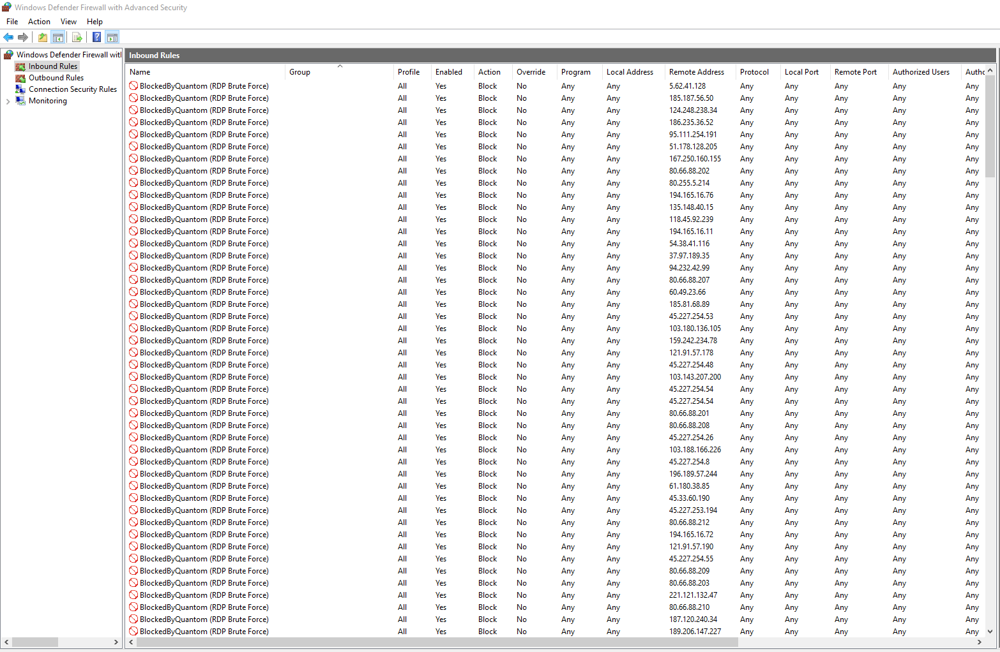

# RdpWall
Is an small Fail2Ban like application that constantly checks for the Windows security Audit Failure [ID=4625] events and blocks IP addresses having failed to login more than 3 times.

## Installation
1. Install Go
2. Clone the repository
3. Run `go build` in `cmd\rdpwall` folder
4. Run the executable with administrator privileges

## Configuration
TODO

## How it works?
- Copies a version of Security.evtx to the executable folder every 5 seconds
- Reads the copied Security.evtx file and parses it for the Audit Failure events
- Checks if the IP has failed to login more than 3 times and if so, blocks it using the Windows Firewall

** All the commands are executed using the Windows command line

## Tested on
- Windows Server 2019

